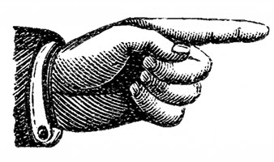

Well, I guess if I'm going to have a website, I might as well have a spot for my own thoughts.  
Free of the LinkedIn algorithm, self-hosted, my own spot to write about . . . well . . . anything.
Almost anything, anyway.  As you can tell, it's a site with my professional resume and my 
professional qualifications, so I'm not about to go join the toxic stew that is modern social 
media discourse and start writing on topics guaranteed to tick off half my audience.  Reddit, as
you may have noticed, is over there: 

That being said, being as I'm in the middle of my second job search (or third, depending on how 
you count it) and my first AI-powered job search, I'm sure I'll have a few things to talk about 
here and there.  The job search bot I've already mentioned I'm building.  Statistical forecasting
I'm still interested in learning more about.  Even Augmented Reality, if it ever comes back into 
vogue in a way that doesn't creep out large swathes of people (RIP HoloLens).  And yes, probably
the pros and cons I've found about using AI.

That said, while I've leveraged the heck out of my robotic assistants getting this place up and 
running, I can safely say that my writing is going to stay a largely bot-free zone.  OK, maybe 
once in a while, I'll get lazy and go "hey Claude, this is a run-on sentence, I'm tired, and I'm 
brainlocking.  Edit plz."  But ultimately, writing is a muscle that needs to get used to keep it 
in shape.  And it's not just for writing prompts, it's for communicating with our fellow humans.
Remember, "I got into tech so I wouldn't have to talk to people" is a joke, not a life strategy.

So here we go, in no particular order and with no particular subject in mind.  At least until I 
end up hired someplace.  Or until the Azure bill gets obnoxious.  Or until a giant meteor strikes 
the Earth.  

Or . . . something.  If you're here, welcome aboard.